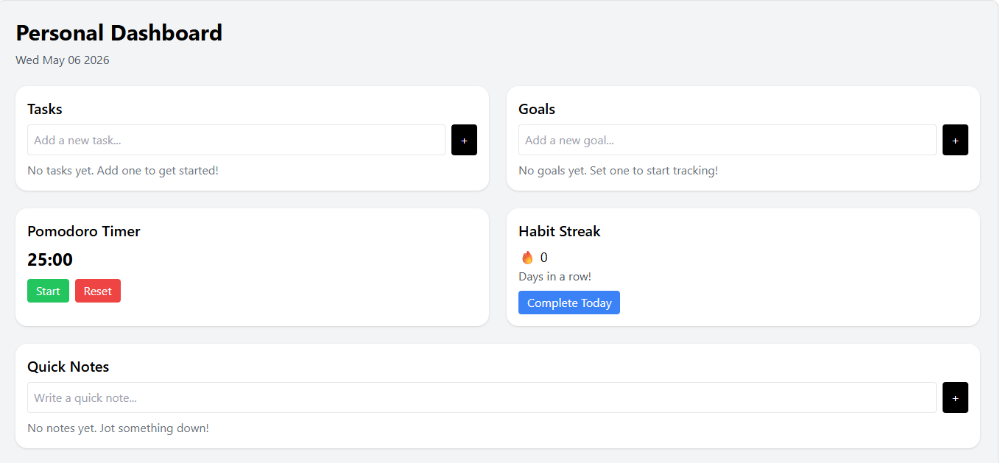

# 🚀 Personal Dashboard

A modern, all-in-one **productivity dashboard** built using **React (Vite)** and **Tailwind CSS** to help users organize their daily workflow efficiently.

This application combines essential productivity tools into a single, clean interface — making it easier to manage tasks, track goals, stay focused, and build consistent habits.

---

## ✨ Features

* ✅ **Task Management** – Add and manage daily tasks effortlessly
* 🎯 **Goal Tracking** – Set and monitor personal goals
* ⏱️ **Pomodoro Timer** – Stay focused using the 25-minute work cycle
* 🔥 **Habit Streak** – Track daily consistency and build discipline
* 📝 **Quick Notes** – Capture ideas instantly without distraction

---

## 🖥️ UI Highlights

* Clean and minimal design
* Fully responsive layout
* Smooth user experience with intuitive interactions
* Built with utility-first styling using Tailwind CSS

---

## 🛠️ Tech Stack

* **Frontend:** React (Vite)
* **Styling:** Tailwind CSS
* **Language:** JavaScript (ES6+)

---

## 📦 Installation & Setup

```bash
# Clone the repository
git clone https://github.com/your-username/personal-dashboard.git

# Navigate into project folder
cd personal-dashboard

# Install dependencies
npm install

# Run development server
npm run dev
```

---

## 📸 Preview

*Add your project screenshot here for better presentation*

```

```

---

## 🚀 Future Enhancements

* 💾 LocalStorage / Database integration for data persistence
* 🌙 Dark mode support
* 🗑️ Edit/Delete functionality for tasks and goals
* 🔔 Notifications & sound alerts for Pomodoro sessions
* 📊 Analytics for productivity tracking

---

## 📚 What I Learned

* Managing state effectively in React
* Building reusable UI components
* Structuring a scalable frontend project
* Designing clean and responsive interfaces with Tailwind CSS

---

## 🤝 Contributing

Contributions, issues, and feature requests are welcome!

---

## 📄 License

This project is open-source and available under the MIT License.

---

## 🌐 Connect with Me

If you liked this project or have suggestions, feel free to connect!
